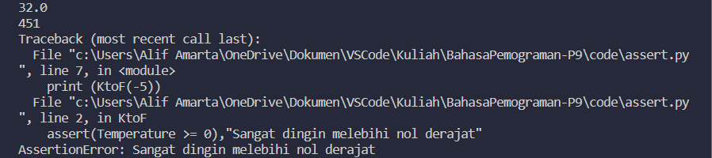
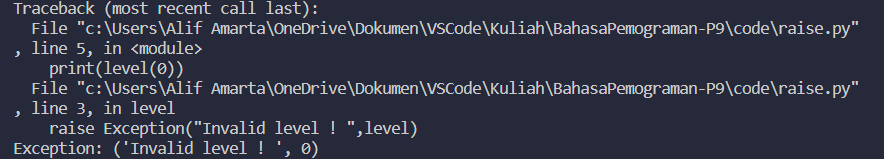
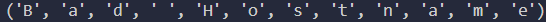

# Praktikum 9
Nama : Alif Nur Fathlii Amarta

Kelas : TI 22 A3

NIM : 312210326

## Exception Handling

Python menyediakan 2 fitur paling penting untuk menangani ```unexpected error``` untuk Python yaitu
- **Exception Handling** 
- **Assertions**

### Assertions in Python
Assertions Exception adalah sebuah peristiwa, yang terjadi selama pelaksanaan program yang mengganggu aliran normal instruksi program

Syntax untuk assert 

    assert Expression[, Arguments]

contohnya:

```
def KtoF(Temperature):
    assert(Temperature >= 0),"Sangat dingin melebihi nol derajat"
    return((Temperature-273)*1.8)+32

print (KtoF(273))
print (int(KtoF(505.78)))
print (KtoF(-5))
```

Hasilnya:



### try...except

Contoh syntax nya:
```
try:
......................

except ExceptionI:
......................

except ExceptionII:
......................

else:
......................

```

Contoh:
```
try:
    fh = open("testfile","w ")
    fh.write("File for exception handling")

except IOError:
    print("Error: cannot find file or read data")

else:
    print("Konten berhasil di-write")
    fh.close()
```

Hasilnya:


### try-finally

Contoh syntax nya
```
try:
......................

finally:

......................
```
Contoh penggunaannya:
```
try:
    fh = open("testfile","w")
    fh.write("Hello :)")
finally:
    print("ERROR: CANNOT FIND FILE OR DATA")
```

Hasilnya:


Contoh lainnya:
```
try:
    fh = open("testfile","w")
    try:
        fh.write("File for exception handling")
    finally:
        print("FILE AKAN DITUTUP")
        fh.close()
except IOError:
    print("ERROR: CANNOT FIND THE FILE OR DATA")
```
### Raise 
Contoh syntax:

    raise [Exception [, args [, traceback]]]

Contohnya:

```
def level(level):
    if level < 1 :
        raise Exception("Invalid level ! ",level)

print(level(0))
```
Hasilnya: 



### User Defined Exceptions
Contohnya :
```
class NetworkError(RuntimeError):
    def __init__(self, arg):
        self.args = arg
try:
    raise NetworkError("Bad Hostname")
except NetworkError as e:
    print (e.args)
```
Hasilnya: 


